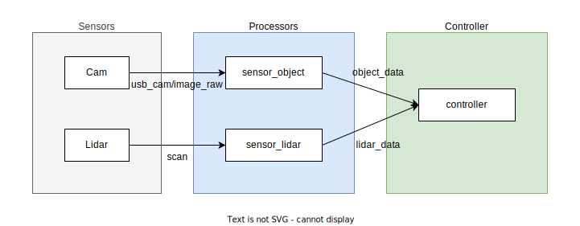

# Traffic Sign Position Estimation

## Key Objectives for This Project

1. _Use_ **YOLOv3-tiny** model from a previous project
1. _Convert_ YOLO model to **TensorRT** model for inference
1. _Obtain_ **point cloud** data from the lidar
1. _Estimate_ the **position** of the traffic sign
   - Calibrate camera
   - Remove distortion of camera
   - Write a good estimation algorithm for position
   - Merge data from camera and lidar (**Sensor Fusion**)

---

## Project S/W Architecture



### Topic Types

- `usb_cam/image_raw`
  - [`sensor_msgs::Image`](http://docs.ros.org/en/api/sensor_msgs/html/msg/Image.html)
- `scan`
  - [`sensor_msgs::LaserScan`](http://docs.ros.org/en/api/sensor_msgs/html/msg/LaserScan.html)
- `lidar_data`
  - [`pcl::PointCloud<T>`](https://pointclouds.org/documentation/classpcl_1_1_point_cloud.html)
  - [`pcl::PointXYZ`](https://pointclouds.org/documentation/structpcl_1_1_point_x_y_z.html)
- `object_data`
  - Custom message which includes bounding box info

---

## Specifications

### H/W Devices Spec

- USB Camera: 640x480
- Main Board: Nvidia Jetson TX2
- Vehicle: Xycar (1:10 model car)

### Machine Learning Spec

- Training Env: Deep Learning AMI GPU PyTorch 1.13.1 (Ubuntu 20.04) 20230103
- Runtime Env: Xycar Nvidia Jetson TX2 Board
- ML model: YOLOv3-tiny
- ML Pipeline: Pytorch -> Darknet -> ONNX -> TensorRT

---

## Referenced Repos

- <https://github.com/2damin/yolov3-pytorch>
- <https://github.com/2damin/yolov3_onnx_rt>
- <https://github.com/2damin/yolov3_trt_ros>
- <https://github.com/junekimdev/kdt-autodrive4-team3-week11-12>

---

## User Guides

1. Clone this repo

   ```shell
   git clone https://github.com/junekimdev/kdt-autodrive4-team3-week16.git <YOUR_DIR_NAME>

   cd <YOUR_DIR_NAME>
   ```

1. Create a branch from `master` branch

   ```shell
   git checkout -b <YOUR_BRANCH_NAME> master
   ```

1. Write your own codes and commit

   ```shell
   git add .
   git commit -m "An awesome commit message"
   ```

1. Push your local branch to remote branch in remote repo.

   ```shell
   git checkout <YOUR_BRANCH_NAME>

   # First time
   git push -u origin <YOUR_BRANCH_NAME>
   # Next
   git push
   ```

   > ⚠️ DON'T PUSH TO `master` branch

1. Create PR(Pull Reqeust) in GitHub

   - Do it via GitHub webpage
   - Write some great PR comments

1. After updates, fetch remote repo and merge it into your local workspace

   ```shell
   git fetch origin master
   git merge origin master

   # or
   git pull origin master
   ```

---

## Coding Style

### Python

Use `PEP8` sytle

### C++

Use `ROS1` style (via `clang-format`)

> See: <http://wiki.ros.org/CppStyleGuide>

- [Team's Naming Convention](naming_convention.md)

---

## License

[](http://creativecommons.org/licenses/by-nc-sa/4.0/)

This work is licensed under a [Creative Commons Attribution-NonCommercial-ShareAlike 4.0 International License](http://creativecommons.org/licenses/by-nc-sa/4.0/)
